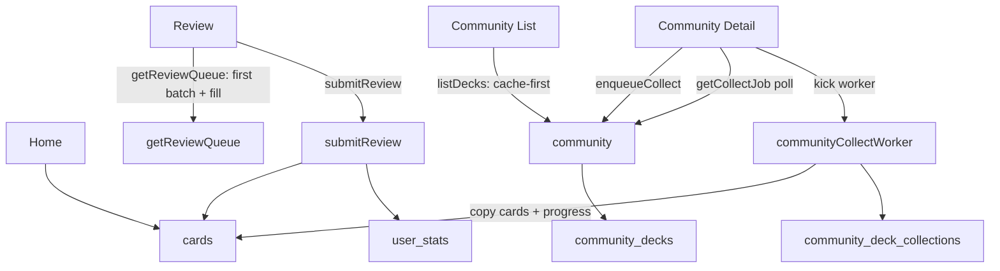

# LearnCards 小程序架构说明（性能/可维护性优先）

本文档描述当前小程序（以 `xuexikazi/` 目录为运行工程）的目录结构、数据模型、关键数据流与云函数连接方式。目标是保证 **页面 UI 与业务逻辑解耦**、**数据全部来自云数据库**，并通过 **缓存/乐观 UI/后台任务** 提升关键交互的体感速度。

## 文档导航（建议按顺序阅读）

- `docs/architecture.md`：入口（运行方式、关键概念、关键数据流、权限/触发器/索引建议）
- `docs/diagrams/system_architecture.mmd.md`：系统架构图（graph TD）
- `docs/diagrams/sequences.md`：核心业务时序图（login / collect / review / create / delete）
- `docs/diagrams/er.mmd.md`：数据库 ER 图（核心实体与关系）
- `docs/diagrams/dependencies.mmd.md`：依赖图（pages / services / cloudfunctions）

## 项目如何运行（从启动到页面）

- **启动入口**：`miniprogram/app.js`
  - `wx.cloud.init({ env })` 初始化云环境
  - 初始化全局 UI 状态：theme / systemTheme / statusBarRpx / safeBottomRpx
  - 初始化 i18n：`utils/i18n.js`（locale 检测，页面可通过 `getApp().getI18n(ns)` 获取文案）
  - 预取缓存：启动后会预取 Community 的 hot 列表并写入本地缓存（减少首次进入空白）
- **页面结构**：`miniprogram/pages/*`
  - 页面只负责 UI 状态与交互；不直接调用云函数/数据库
- **业务层**：`miniprogram/services/*`
  - `services/cloud.js` 是云函数统一封装（`callOkFunction`）
  - 其余 services 以函数形式封装业务逻辑（cards/community/userStats 等）

## 运行目录结构（以 `xuexikazi/` 为准，逐项备注）

```
xuexikazi/
├─ miniprogram/                 # 小程序主包
│  ├─ app.js                    # 主题/云初始化/预取
│  ├─ pages/                    # 页面（路由入口）
│  │  ├─ home/                  # 首页：Deck 列表/搜索筛选/学习复习入口/删除 deck（乐观 UI）
│  │  ├─ review/                # 学习/复习：首批队列快速返回 + 后台补全；提交结果后台上报
│  │  ├─ library/               # 卡库/创建入口：选择模式、进入详情页
│  │  │  └─ detail/             # （保留目录，当前无文件；实际详情页使用 library/detail.*）
│  │  ├─ library/detail.*       # Deck 详情：卡片列表、增删改、发布到 Community 等
│  │  ├─ community/             # 社区：列表缓存优先 + 后台刷新
│  │  ├─ community/detail.*     # 社区详情：点赞/收藏（enqueueCollect + 进度轮询 + worker kick）
│  │  ├─ goals/                 # 目标：dailyGoal/进度（读写 user_stats）
│  │  ├─ leaderboard/           # 排行榜：读取 getGlobalRank（走 leaderboard_cache 快路径）
│  │  ├─ profile/               # 我的：用户信息/设置（读写 user_stats）
│  │  ├─ admin/                 # 管理页：仅管理员使用（与云函数 admin 配套）
│  │  ├─ editor/                # 旧编辑器：历史保留（兼容旧数据）
│  │  └─ feynman/               # 费曼页：目录保留（当前无文件）
│  ├─ services/                 # 业务服务层（页面不直连云能力）
│  │  ├─ cloud.js               # 云函数统一封装（callFunction/callOkFunction）
│  │  ├─ auth.js                # 登录/openid 获取与缓存（login）
│  │  ├─ cards.js               # cards CRUD/分页查询/聚合 decks/due 查询
│  │  ├─ community.js           # Community：list/get/like/collect（含 enqueueCollect/getCollectJob/kick）
│  │  ├─ userStats.js           # user_stats：读取/写 dailyGoal/更新头像昵称等
│  │  ├─ activity.js            # 埋点/事件记录（复习记录等）
│  │  ├─ time.js                # 时间格式化（相对时间等）
│  │  ├─ ocr.js                 # 上传图片 + analyzeImage OCR
│  │  ├─ ai.js                  # AI 生成卡片（与 worker/解析逻辑配套）
│  │  ├─ createJobs.js          # 创建任务/后台生成相关（create_jobs）
│  │  ├─ pendingCreate.js       # 断点续传：Create Step3 后台继续写卡
│  │  └─ defaultDecks.js        # 默认卡包策略（官方默认卡包已迁移到 Community）
│  └─ utils/                    # 通用工具（被 services/pages 复用）
│     ├─ config.js              # 环境常量
│     ├─ flashcard-config.js    # 集合/字段配置常量（历史兼容）
│     ├─ i18n.js                # 国际化：locale 检测与文案构建
│     ├─ richText.js            # 富文本渲染/转换工具
│     ├─ sm2.js                 # SM-2 间隔重复算法实现
│     └─ legacy-model-config.js # 历史模型配置（兼容旧逻辑）
└─ cloudfunctions/              # 云函数（按文件夹独立部署）
   ├─ login/                    # 登录：获取 OPENID（给前端按 _openid 查询做隔离）
   ├─ analyzeImage/             # OCR：输入 fileID，调用视觉模型输出文本
   ├─ submitReview/             # 复习提交：更新 cards 的 SRS 字段 + 更新 user_stats（XP/streak）
   ├─ getReviewQueue/           # ✅ 队列首批：Review/Study 首批快速返回 + 支持 skip/limit 分页
   ├─ community/                # Community：列表/详情/点赞/发布；✅ enqueueCollect/getCollectJob（写 community_collect_jobs）
   ├─ communityCollectWorker/   # ✅ 收藏 worker：定时触发器 + 客户端可 kick；拷卡到 cards 并更新进度
   ├─ getGlobalRank/            # 排行榜 API：优先读 leaderboard_cache/latest（Top50 精确 + 近似 rankText）
   ├─ leaderboardWorker/        # 排行榜 worker：定时预计算写 leaderboard_cache/latest
   ├─ resetDailyScore/          # 后台 worker：处理 create_jobs（OCR/AI 生成/写 cards），带 lease lock + 重试
   ├─ forkCard/                 # 卡片 fork：幂等写入（用于社区/复用等场景）
   └─ admin/                    # 管理功能：管理员工具/运维脚本入口
```

## 数据模型（云数据库）

### `cards`
- **用户隔离**：每条记录带系统字段 `_openid`。
- **核心字段（前端写入/更新）**：`deckTitle`, `question`, `answer`, `tags`, `createdAt`, `updatedAt`
- **复习字段（云函数 `submitReview` 维护）**：`nextReviewAt`, `lastReviewedAt`, `srsEF`, `srsInterval`, `srsReps`
- **兼容字段（旧数据/富文本/来源）**：`answerSections`, `sourceImage`, `sourceImages` 等
- **来自 Community 收藏的标记**：`sourceCommunityDeckId`, `sourceCommunityCardIndex`, `sourceCommunityTitle`

### `user_stats`
- 用户维度统计（`_openid` 隔离），由 `submitReview` 维护 XP/连续天数等；前端维护 `dailyGoal`、头像昵称等展示字段。

### `leaderboard_cache`
- `leaderboardWorker` 定时写入 `latest` 文档（Top50 + xpBuckets + totalUsers），`getGlobalRank` 快路径读取，降低 P95。

### `community_*`（社区功能）
- `community_decks`：社区卡包（含 cards 预览与统计）
- `community_deck_likes`：用户点赞记录（docId 通常为 `OPENID_deckId`）
- `community_deck_collections`：用户收藏记录（docId 通常为 `OPENID_deckId`）
- `community_collect_jobs`：✅ 收藏后台任务队列（用于“秒反馈 + 进度”）

## 关键概念（看图前先对齐术语）

- **Cache-first**：页面先读本地缓存渲染，再后台刷新（Community 列表 / Home decks）
- **Optimistic UI（乐观 UI）**：先更新 UI（让用户感觉“立刻生效”），后台执行真正写库；失败回滚（Home 删除 deck）
- **Job + Worker**：把长耗时操作移出点击链路（Community 收藏：enqueueCollect 秒回 + worker 拷卡）
- **Idempotency（幂等）**：相同请求重复执行不会产生副作用（收藏 jobId、forkCard 的 docId、submitReview 的 lastReviewKey 等）
- **Lease Lock（租约锁）**：通过事务把 job 标记为 running 并设置 lockId/updatedAt，避免并发 worker 重复处理同一 job
- **Projection（字段投影）**：只返回 UI 需要字段（getReviewQueue `.field()`），减少传输与解析

## Deck 分组策略（不新增 `decks` 集合）

Deck 完全由 `cards.deckTitle` 聚合得出：缺失/空/`Inbox` 视为同一组（Inbox）。Home 页统计由前端聚合计算得到。

## 云函数连接（前端统一入口）

前端通过 `miniprogram/services/cloud.js` 统一调用云函数：
- `login`：获取 OPENID
- `submitReview`：提交复习结果，更新 `cards` SRS + `user_stats`
- `getReviewQueue`：✅ 首批队列快速返回（支持 `limit/skip` 分页，前端后台补全队列）
- `community`：社区卡包列表/详情/点赞/发布；✅ `enqueueCollect` / `getCollectJob`
- `communityCollectWorker`：✅ 收藏后台 worker（定时 + 可被客户端 kick）
- `leaderboardWorker`：定时预计算 `leaderboard_cache/latest`
- `getGlobalRank`：读取 `leaderboard_cache/latest` 返回 Top50 + 近似名次
- `analyzeImage`：OCR（Moonshot Vision）

## 关键数据流（简化）



## 索引 / 触发器 / 权限建议（上线前检查）

- **触发器（必须上传）**
  - `cloudfunctions/leaderboardWorker/config.json`：定时预计算排行榜缓存
  - `cloudfunctions/resetDailyScore/config.json`：定时处理 create_jobs（后台生成）
  - `cloudfunctions/communityCollectWorker/config.json`：定时处理收藏队列
- **索引建议（推荐）**
  - `cards`：`_openid`、`_openid+deckTitle`、（可选）`_openid+nextReviewAt`
  - `user_stats`：`xp`（用于排行榜）
  - `community_decks`：`hotScore`、`downloadCount`、`createdAt`
  - `community_collect_jobs`：`status`、`status+updatedAt`（worker 捞取队列更稳定）
- **权限建议（按你隐私策略选择）**
  - `cards`：默认按 `_openid` 隔离（推荐保持）
  - `user_stats`：若需要“全量排行榜展示”，需要评估是否允许所有用户可读

## 常见问题排查（Debug Checklist）

- **Community 收藏后卡库没出现**
  - 先确认：`community_collect_jobs` 集合存在且有 job 记录
  - 再确认：`communityCollectWorker` 已部署且触发器已上传（或客户端 kick 生效）
  - 最后确认：拷贝到 `cards` 的记录带 `_openid` 且 deckTitle 正确（通常为 community deck 的 title）
- **Review/Study 进入慢**
  - 确认 `getReviewQueue` 已部署（首批 20 需要它）
  - 确认 `cards` 查询字段投影与索引是否合理
- **排行榜慢**
  - 确认 `leaderboardWorker` 触发器是否运行并写入 `leaderboard_cache/latest`

## 运行与权限要点

- **云能力初始化**：`miniprogram/app.js` 中 `wx.cloud.init({ env })`
- **读写隔离**：`cards` 默认按 `_openid` 隔离
- **隐私**：如需展示全量排行榜，需要评估 `user_stats` 的可读权限策略
