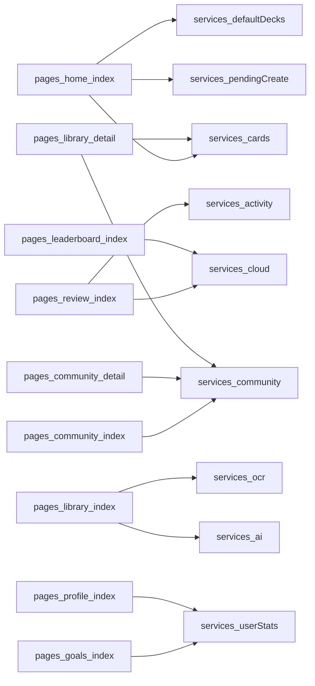
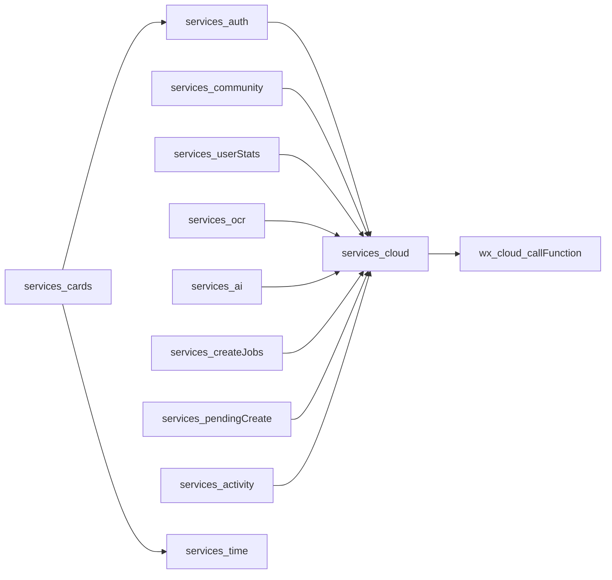
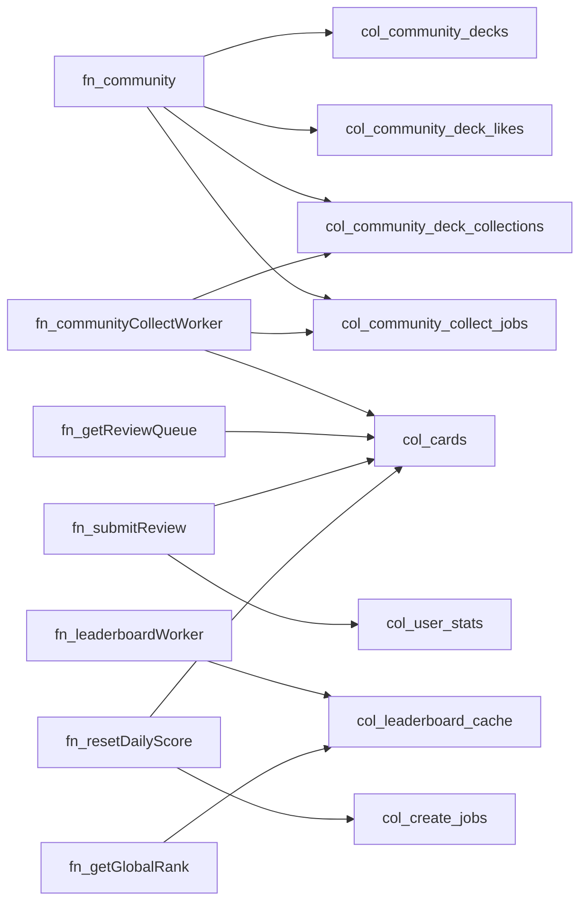

# Dependency Graphs (Core Files Only)

> 说明：依赖图只展示核心 10–15 个文件，帮助你在重构前快速看清层级关系。\n> 图中省略了 `utils/*` 和少量页面细节，以免过度噪声。

## 1) Pages -> Services (graph LR)

## 2) Services internal deps (graph LR)

## 3) Cloudfunctions -> DB collections (graph LR)

