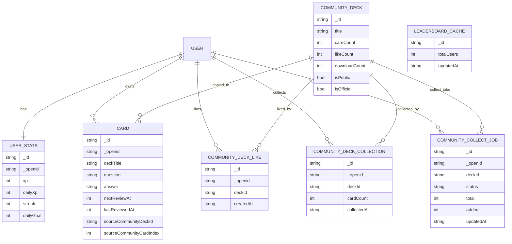

# ER Diagram (Core Entities)

> 说明：CloudBase 是 NoSQL，但我们用 ER 图表达“核心集合 + 关系约束”的心智模型。\n> 重点是 `_openid` 用户隔离、以及 Community 收藏/点赞/任务队列的关系。

## Notes

- **USER 并不是一个真实集合**：它代表 CloudBase 的用户身份（`OPENID`），在集合里体现为系统字段 `_openid`。\n- **一对多关系**：`USER -> CARD`、`COMMUNITY_DECK -> COMMUNITY_COLLECT_JOB` 等。\n- **收藏拷贝关系**：Community deck 被收藏后，卡片会复制进用户自己的 `cards`，并带 `sourceCommunityDeckId/sourceCommunityCardIndex`，用于幂等与断点续传。\n

