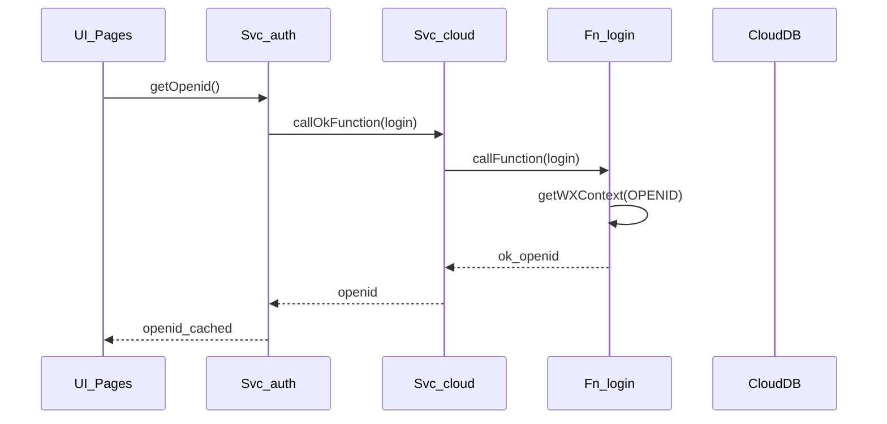
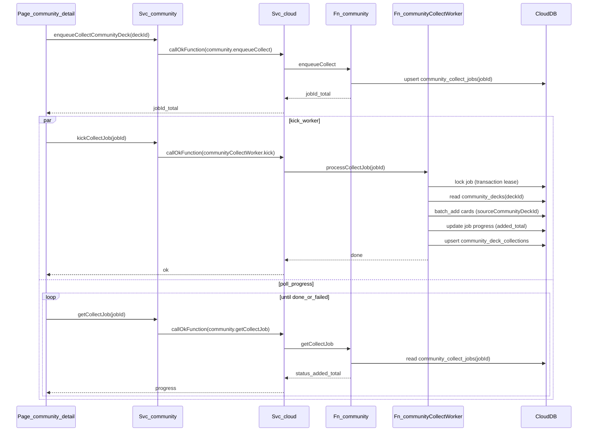
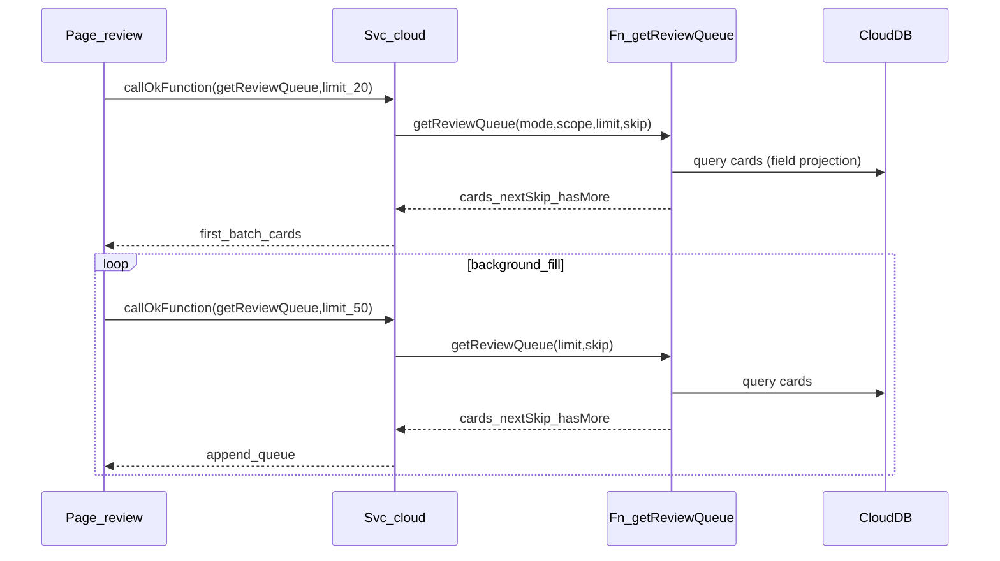
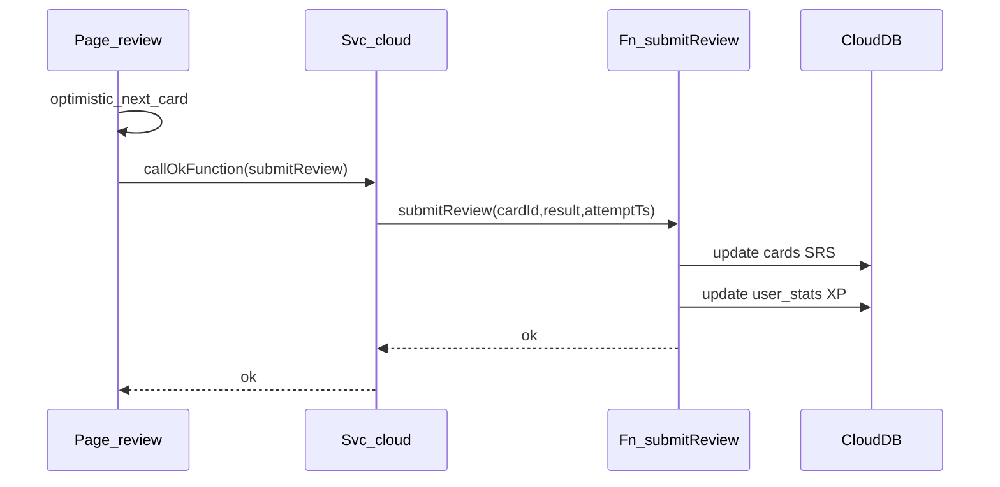
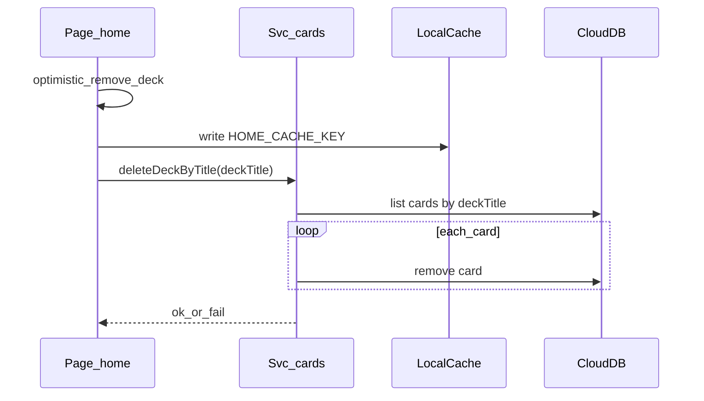

# Core Business Sequence Diagrams

> 说明：为避免 Mermaid 解析报错，所有 participant id 均无空格；边上的 label 尽量避免特殊字符。

## 1) Login (openid)

How to read:
- 目标是得到 `OPENID`，后续所有数据库读写依赖 `_openid` 自动隔离。
- 云函数 `login` 只应做轻量逻辑，避免成为全链路瓶颈。

## 2) Community Collect (enqueue + poll + worker)

How to read:
- 点击收藏后 **秒回 jobId**（不阻塞 UI），进度来自 `community_collect_jobs`。
- 真正拷贝卡片在 `communityCollectWorker` 中执行，避免点击链路卡顿。
- worker 用 lease lock 防止并发重复处理同一 job。

## 3) Review/Study Entry (first batch + background fill)

How to read:
- “首批 20”优先保证进入就能开始学，避免白屏等待。
- 后台分页补全只更新 `totalCards` 等轻量 UI，不打断当前卡片流程。

## 4) Submit Review (background submit)

How to read:
- UI 先切下一张卡，再后台提交；失败走重试/幂等保护（避免双加 XP）。

## 5) Delete Deck (optimistic remove + background delete)

How to read:
- UI 立即移除 deck（丝滑），删除失败再回滚 snapshot。

