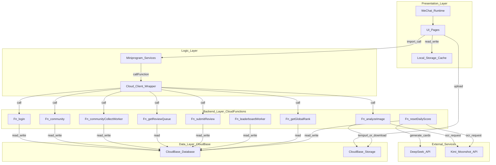

# System Architecture Diagram (graph TD)

## How to read

- Presentation 层主要是页面与本地缓存（“秒开/丝滑”很多来自 cache-first 与 optimistic UI）。
- Logic 层是 `miniprogram/services/*`，页面不直接访问云函数/数据库。
- Backend 层每个云函数是一个独立部署单元（按目录上传）。
- Data 层是 CloudBase 数据库/存储；External 是 OCR/LLM。

